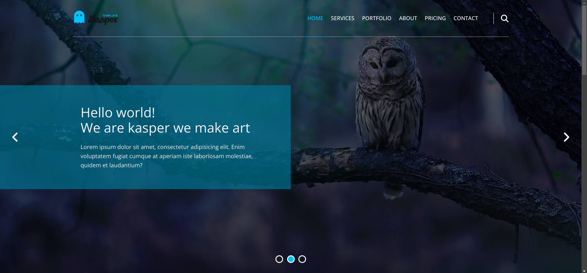
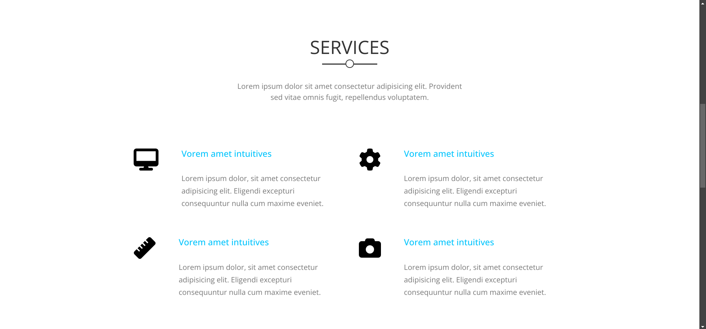
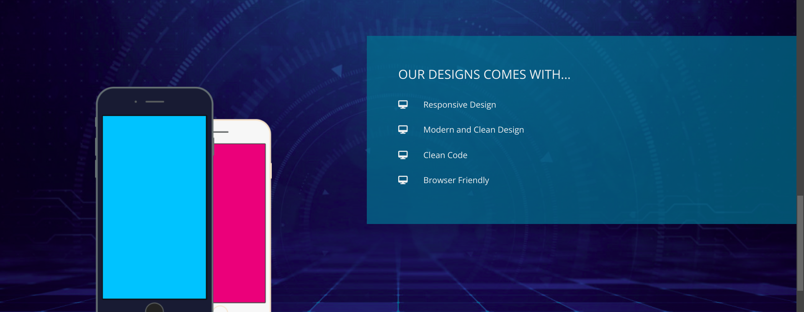

## Project Overview

This project utilizes HTML, CSS, the CSS Normalize library, and FontAwesome to create a responsive web template. Media queries are used to ensure the template is mobile-friendly.

### Technologies Used

- **HTML**: For structuring the content.
- **CSS**: For styling the content.
- **CSS Normalize Library**: To make browsers render all elements more consistently and in line with modern standards.
- **FontAwesome**: For scalable vector icons that can be customized with CSS.

### Features

- **Responsive Design**: The template is designed to be fully responsive and works well on mobile devices using media queries.
- **Cross-Browser Compatibility**: The use of the CSS Normalize library ensures compatibility across different browsers.

### Getting Started

To get started with this project, clone the repository and open the `index.html` file in your browser.

```bash
git clone /home/karimsafan/Elzero/Templates/Template-two
cd Template-two
open index.html
```

### Screenshots

Below are some screenshots of the project:



